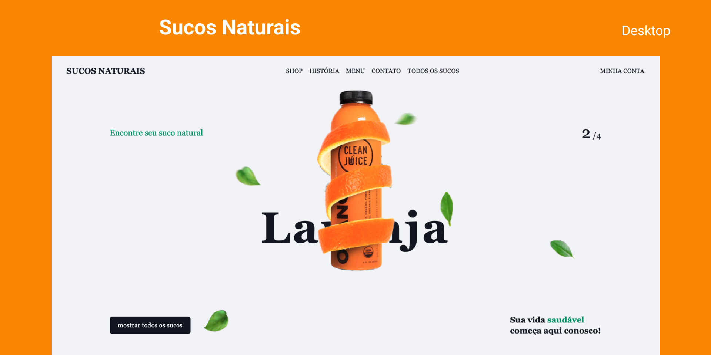

<p align="center">
  SUCOS NATURAIS
</p>

<p align="center">
  
</p>

<h1 align="center">
    
</h1>

<br>

## 🧪 Tecnologias

Esse projeto foi desenvolvido com as seguintes tecnologias:

- [React](https://reactjs.org)
- [Tailwindcss](https://tailwindcss.com/)
- [Framer-motion](https://www.framer.com/motion/)
- [TypeScript](https://www.typescriptlang.org/)

## 🚀 Como executar

Clone o projeto e acesse a pasta do mesmo.

```bash
$ git clone https://github.com/jrxr/juice-animation.git
$ cd juice-animation
```

Para iniciá-lo, siga os passos abaixo:
```bash
# Instalar as dependências
$ yarn
# Iniciar o projeto
$ yarn dev
```
O app estará disponível no seu browser pelo endereço http://localhost:3000.


## 💻 Projeto

Este projeto teve com intuito treinar as habilidades de animação, foi desenvolvido com typescript, tailwindcss e framer-motion. 

## 📝 License

Esse projeto está sob a licença MIT. Veja o arquivo [LICENSE](LICENSE.md) para mais detalhes.

---

Feito com 💜 by Agacy Júnior 💻